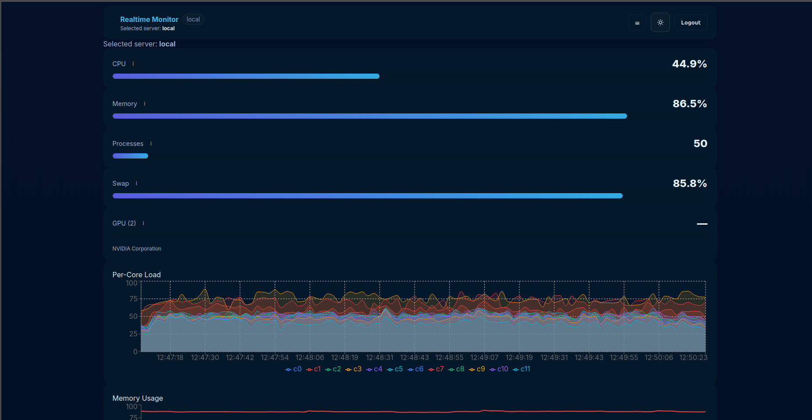
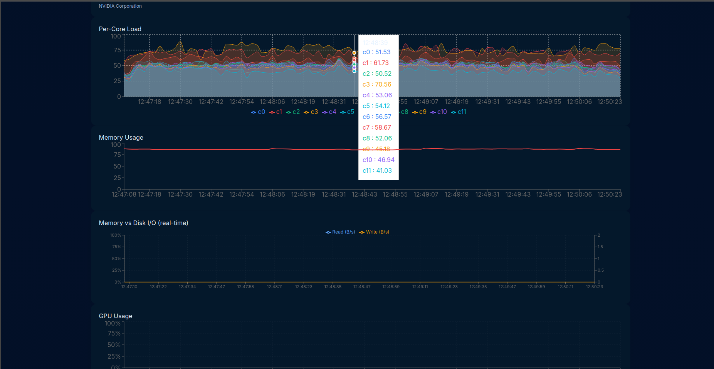
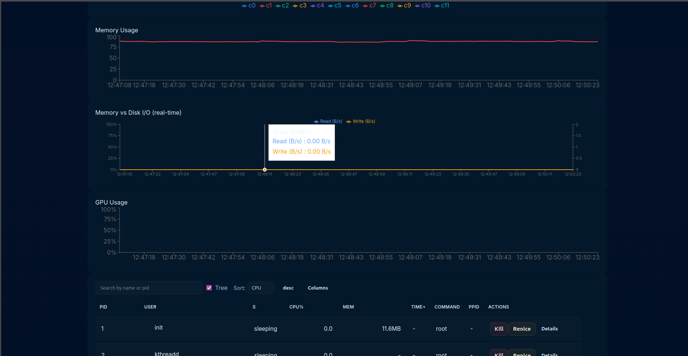

# System Monitor — Application Web de Monitoring Système

Un projet simple pour visualiser en temps réel les métriques système (CPU, mémoire, processus, swap, GPU si disponible) via une interface web.

Ce README explique comment lancer l'application localement (backend + frontend), avec ou sans Docker, et comment dépanner les problèmes fréquents.

## Prérequis
- Node.js (>= 18 LTS) et npm ou yarn
- Git
- (Optionnel) Docker & Docker Compose si vous souhaitez exécuter avec des conteneurs

## Structure du dépôt
- `backend/` : API Express + Socket.IO, collecte des métriques (systeminformation)
- `frontend/` : application React + TypeScript (Vite)
- `docker-compose.yml` : composition optionnelle

## Installation (sans Docker)

1. Cloner le dépôt :

```bash
git clone <repo-url>
cd application-web-de-monitoring-de-processus
```

2. Installer et lancer le backend :

```bash
cd backend
npm install
# Copier .env.example vers .env si besoin et ajuster les variables
# Exemple minimal :
#   PORT=4000
#   JWT_SECRET=change_me

# Lancer en mode dev
npm run dev
```

3. Installer et lancer le frontend :

```bash
cd ../frontend
npm install
npm run dev
```

Ensuite ouvrez `http://localhost:5173` (ou l'URL indiquée par Vite) dans votre navigateur.


## Variables d'environnement importantes
- `PORT` : port d'écoute du backend (par défaut `4000`)
- `JWT_SECRET` : secret JWT (par défaut `change_me` en dev)
- `DEBUG_GPU` : si défini (ex. `DEBUG_GPU=1`) active la journalisation détaillée des infos GPU côté backend

Exemple pour lancer le backend avec debug GPU :

```bash
DEBUG_GPU=1 npm run dev
```

## Comment ça marche (rapidement)
- Le backend collecte périodiquement des métriques via le package `systeminformation` et émet des événements WebSocket `metrics:update`.
- Le frontend se connecte automatiquement (après login demo) et reçoit les mises à jour en temps réel pour alimenter les graphiques.

## Dépannage rapide
- Erreurs de démarrage Node/TypeScript : assurez-vous d'utiliser une version Node moderne (>=18). Nettoyez `node_modules` et réinstallez si besoin (`rm -rf node_modules && npm install`).
- Backend renvoie `No GPU` dans l'UI :
  - Lancez le backend avec `DEBUG_GPU=1` et regardez les logs. Ils afficheront la sortie de `systeminformation.graphics()` puis la forme normalisée envoyée au frontend.
  - Certains systèmes ne fournissent pas l'utilisation GPU (util) via `systeminformation`; dans ce cas l'UI affichera le nombre de GPU détectés et le nom/fournisseur.
- Erreurs CORS ou WebSocket : vérifiez que le frontend se connecte à l'URL correcte (`http://localhost:4000`) et que `io` est configuré pour autoriser `origin: '*'` (en dev).

## Tests
- Backend : `cd backend && npm test` (si des tests sont présents)
- Frontend : `cd frontend && npm test`

## Contribution
- Forkez le projet, créez une branche feature/bugfix, ouvrez une Pull Request. Soyez sûr d'ajouter des tests pour les changements significatifs.

## Remarques et améliorations possibles
- Ajouter une collecte GPU spécifique pour NVIDIA (`nvidia-smi`) si `systeminformation` ne fournit pas l'utilisation.
- Ajouter authentification utilisateur sérieuse et ACLs pour les actions sensibles (kill/renice).
- Ajouter configuration via UI pour sélectionner serveurs distants et leurs credentials.

---

Si vous voulez que je rédige une version plus complète (exemples `.env`, `docker-compose` détaillé, ou instructions de déploiement), dites-moi ce que vous préférez et je l'ajouterai.

#### Backend
- **Runtime** : Node.js 20+ (LTS)
- **Framework** : Express.js ou Fastify
- **Langage** : TypeScript
- **WebSocket** : Socket.io
- **Collecte métriques** : 
  - `systeminformation` (npm package)
  - `node-os-utils`
  - `pidusage`
- **Base de données** : 
  - PostgreSQL (données historiques)
  - Redis (cache et données temps réel)
- **ORM** : Prisma ou TypeORM

#### Infrastructure
- **Conteneurisation** : Docker + Docker Compose
- **Reverse Proxy** : Nginx
- **CI/CD** : GitHub Actions ou GitLab CI
- **Monitoring applicatif** : PM2
- **Tests** : Jest, React Testing Library, Supertest

### 2.2 Architecture Système

```
┌─────────────────────────────────────────────────────┐
│                   CLIENT (Browser)                   │
│  ┌──────────────┐  ┌──────────────┐  ┌───────────┐ │
│  │ React UI     │  │ State Mgmt   │  │ WebSocket │ │
│  │ Components   │  │ (Redux)      │  │ Client    │ │
│  └──────────────┘  └──────────────┘  └───────────┘ │
└────────────────────────┬────────────────────────────┘
                         │ HTTPS/WSS
┌────────────────────────┴────────────────────────────┐
│                  NGINX (Reverse Proxy)               │
└────────────────────────┬────────────────────────────┘
                         │
┌────────────────────────┴────────────────────────────┐
│                 APPLICATION SERVER                   │
│  ┌──────────────────────────────────────────────┐  │
│  │           API REST (Express/Fastify)         │  │
│  ├──────────────────────────────────────────────┤  │
│  │        WebSocket Server (Socket.io)          │  │
│  ├──────────────────────────────────────────────┤  │
│  │         Services Layer                       │  │
│  │  ┌────────────┐  ┌────────────────────────┐ │  │
│  │  │ Metrics    │  │ Process Manager        │ │  │
│  │  │ Collector  │  │ Service                │ │  │
│  │  └────────────┘  └────────────────────────┘ │  │
│  └──────────────────────────────────────────────┘  │
└────────────────────────┬────────────────────────────┘
                         │
         ┌───────────────┼───────────────┐
         │               │               │
    ┌────┴────┐    ┌────┴────┐    ┌────┴────┐
    │ Redis   │    │PostgreSQL│    │ System  │
    │ Cache   │    │ Database│    │ Kernel  │
    └─────────┘    └─────────┘    └─────────┘
```





